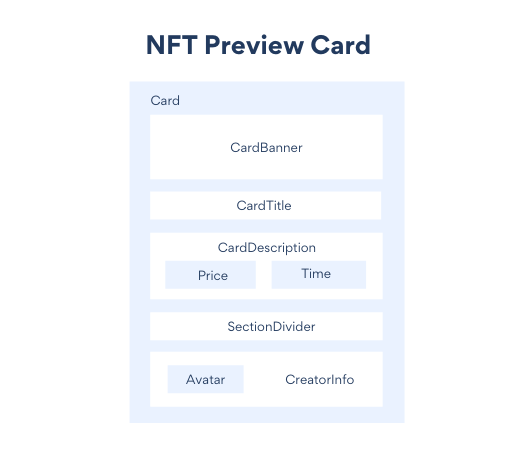

<!-- omit in toc -->
# Project: NFT Preview Card
## About the Project
This project is a simple NFT Preview Card, a challenge taken from Frontend Mentor and made in ReactJS using React Hooks.

## Technologies and Standards Used
**The technologies that have been used are:**
1. HTML (Hyper Text Markup Language)
2. CSS (Cascading Style Sheets)
3. React.js

## Components Hierarchy

## Live Demo
Check the live page [here](https://5hraddha.github.io/nft-preview-card/)